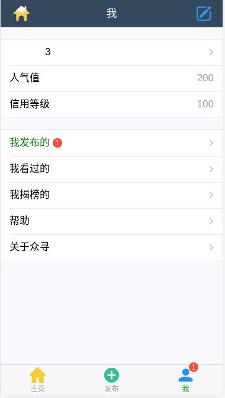

# look-for-web-client

> 外接项目 - 猎头招聘的 Web 前端

## 调试开发
* 下载 look-for 服务器端并按照文档配置好环境
    > [look-for-server](https://github.com/YueHub/look-for-server)
* 下载本项目源码
* 在本地搭建好 node 和 npm，具体请查询官网
* 下载安装依赖包：进入项目目录，执行以下命令
```bash
# 下载安装依赖包
npm install
```

* 启动服务器（调试开发服务器）：进入项目目录，执行以下命令
```bash
# serve with hot reload at localhost:8080
npm run dev
```

* 或者进入项目目录执行以下命令编译项目，将编译结果复制到 nginx 或 tomcat
``` bash
# build for production with minification
npm run build
```

* 访问 http://localhost:8088/#/index

## 运行效果
* 主页:


* 招聘信息发布


* 我的



## License
[MIT License](https://github.com/YueHub/look-for-web-client/blob/master/LICENSE)